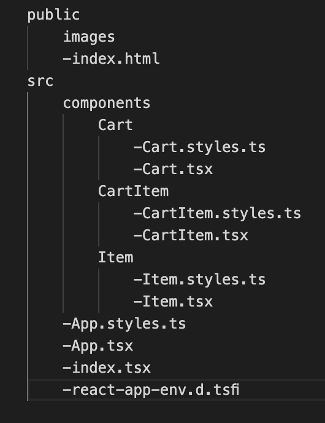

# shopping-cart-with-typescript-react

## 1. Preview

## 2. Description

In this project, I used TypeScript and React to create a small shopping cart.

## 3. Structure Tree

## 4. Application

- This project created by using

    
   

 

## 5. Must Haves

- The data must be provided by an API, https://fakestoreapi.com/.

- A user should be able to see the products and add to the cart.

- When the user click on the add to cart button the badge should show the number of the items in the cart.

- A user should be able to add/remove items from cart.
